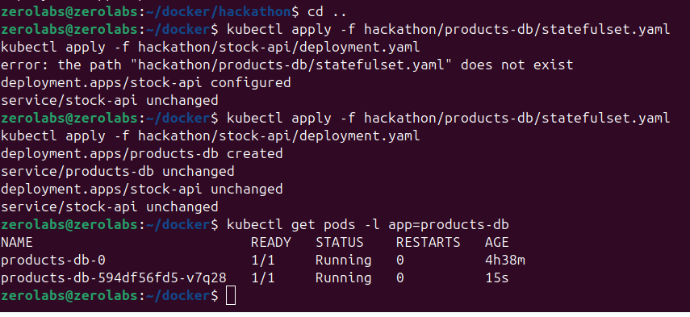
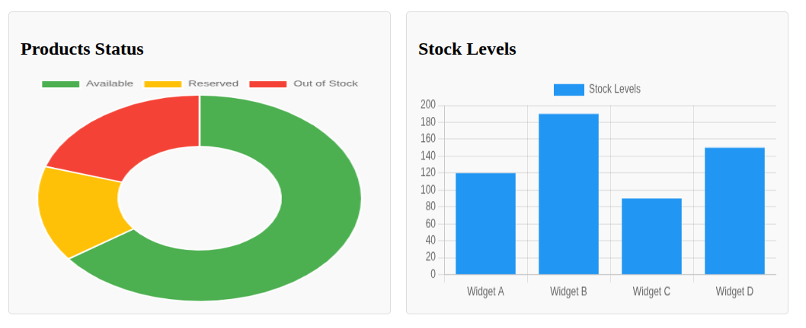

# Kubernetes Hackathon Lab – Products API Deployment

This repository documents our team's deployment and hardening of the Products API and associated services in a Kubernetes environment during a hackathon lab. The lab aimed to simulate real-world DevOps scenarios and apply Kubernetes best practices in deploying production-ready systems.

## Overview

We successfully deployed a multi-service system consisting of:

- `products-db` – a PostgreSQL database
- `products-api` – an API service exposing product data
- `stock-api` – a microservice managing stock levels
- `web-ui` – a frontend interface for interacting with the services

## Key Highlights

- Environment variables managed using ConfigMaps and Secrets
- Persistent storage with StatefulSets and PVCs for the database
- Ingress routing with DNS simulation for seamless access
- Deployment hardening using liveness and readiness probes, resource limits, and security contexts
- Full observability using Prometheus, Grafana, and the EFK logging stack

## Project Structure

```
products-api-deployment/
├── images/                       # Screenshots from various stages
│   ├── 1.png
│   ├── 2.png
│   └── ... up to 14.png
├── deployment.yaml              # Kubernetes deployment configuration
├── config/                      # ConfigMaps and Secrets
├── ingress/                     # Ingress resources and routing rules
├── monitoring/                  # Prometheus and Grafana setup
├── logging/                     # EFK stack configurations
└── README.md
```

## Access Information

- Web UI: `http://products.local`
- Products API: `http://api.products.local/products`
- Grafana: `http://localhost:3000` (Default: admin/admin)
- Kibana: `http://localhost:5601`

Ensure your `/etc/hosts` file is configured to simulate DNS resolution for the local domain.

## Monitoring and Logging

- Prometheus scrapes metrics from the deployed services
- Grafana visualizes metrics using a custom dashboard
- Elasticsearch, Fluentd, and Kibana (EFK) aggregate and display logs

## Hackathon Journey

Below are snapshots from different stages of the deployment process:

### 1. Initial Setup


### 2. Product API Service Deployment


### 3. Products DB Configuration


### 4. Persistent Volume Claims


### 5. ConfigMaps and Secrets


### 6. Ingress Routing


### 7. Web UI Deployment


### 8. Liveness and Readiness Probes


### 9. Security Context Hardening


### 10. Prometheus Integration


### 11. Grafana Dashboard


### 12. Grafana Login & setup


### 14. Final Working Setup


## Team

- Victoria Mwaura  
- Norah Kimathi  
- Joshua Radula  
- Maxwell Opondo

## Summary

This lab was an opportunity to explore and overcome practical challenges in Kubernetes deployment and system design. We emphasized clean configurations, observability, and security to reflect best practices in real-world DevOps environments.
